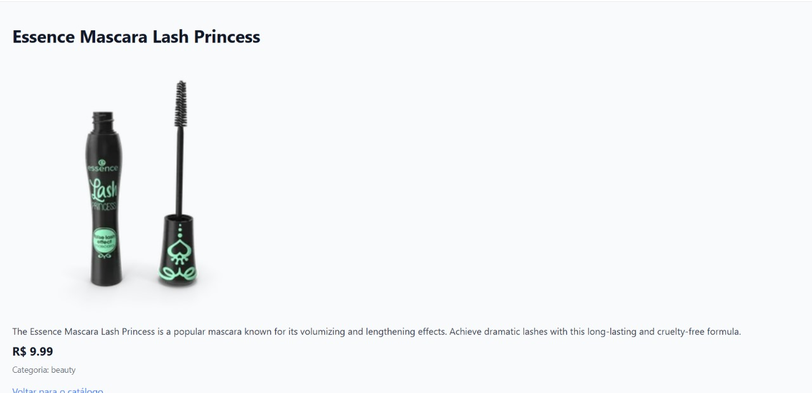

Projeto Ecommerce - 

- Catálogo de E-commerce - Front-End com Vue.js

Este é um projeto desenvolvido para a disciplina de **Tecnologias de Front-End** do curso de **Análise e Desenvolvimento de Sistemas** (2º ano). O objetivo é construir um catálogo de produtos que consome a API [DummyJSON](https://dummyjson.com/docs/products) e oferece uma interface moderna, responsiva e funcional utilizando **Vue.js 3**, **Vite**, **Axios** e **TailwindCSS**.

* Funcionalidades Principais

- Listagem de Produtos 
  Exibe produtos em um grid responsivo com nome, imagem, preço, categoria e estoque.

- Paginação  
  Permite navegar entre páginas de produtos.

- Detalhes do Produto
  Página dedicada com informações completas de um produto selecionado.

- Busca em Tempo Real 
  Campo de pesquisa que filtra produtos por nome conforme o usuário digita.

- Ordenação de Produtos
  Ordenação por preço (crescente/decrescente) e nome (A-Z/Z-A).

* Tecnologias Utilizadas

- [Vue.js 3](https://vuejs.org/)
- [Vite](https://vitejs.dev/)
- [Axios](https://axios-http.com/)
- [TailwindCSS](https://tailwindcss.com/)
- [API DummyJSON](https://dummyjson.com/docs/products)

---

* Instalação e Execução Local

- Pré-requisitos

- Node.js (versão 16 ou superior)
- Git (opcional, para clonar o repositório)

* Clone o repositório

git clone (https://github.com/Leonnavas/Trabalho_6.git)
cd Trabalho_6.git

## 📸 Print das telas

### 🔍 Buscar

### 🛒 Carrinho

### 🗂️ Catálogo

### 📄 Detalhes

### 📑 Paginação

(Assista no Youtube) - https://youtu.be/FDkwzyn0FGY 
